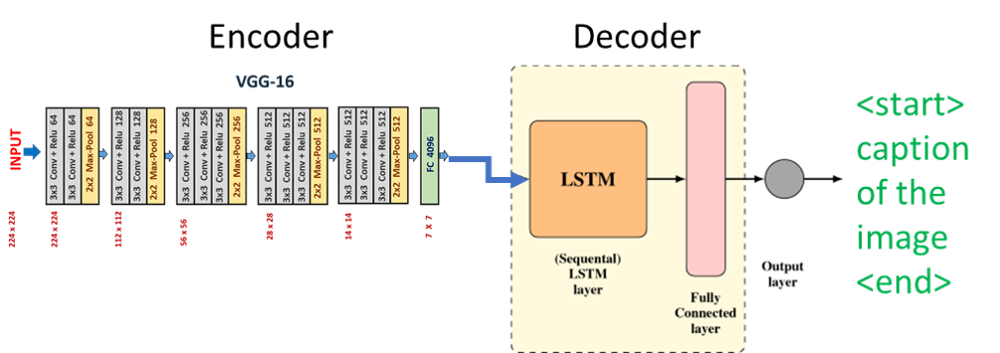

## Simple encoder-decoder network for image captioning

### **1 Install**

- Install requirements:
```
pip install -r requirements.txt
```
- If pycocotools is not working installation below:
```
git clone https://github.com/pdollar/coco.git
cd coco/PythonAPI/
make
python setup.py build
python setup.py install
cd ../../
```
### **2 Download cocodataset**
```
pip install -r requirements.txt
chmod +x download.sh
./download.sh
```

### **3 Preprocess for training**

- Create vocab:
```bash
python build_vocab.py
```

### **4 Train model**
- Setup model parameters by arg:
  - embed_size: dimension of word embedding vectors
  - hidden_size: dimension of lstm hidden states
  - num_layers: number of layers in lstm
  
- Setup training strategy
  - num_epochs
  - batch_size
  - learning_rate
  
- Change image directory and annotation directory if needed
```bash
python train.py
```
- Finetune from checkpoint:
```bash
python train.py --checkpoint_path path/to/checkpoint.pth
```
### **5 Evaluation**
- Evaluation on flickr dataset
```bash
python evaluation.py
```
### **6 Inference**
- Change path input image
```bash
python inference.py --image ./images/160.jpg
```